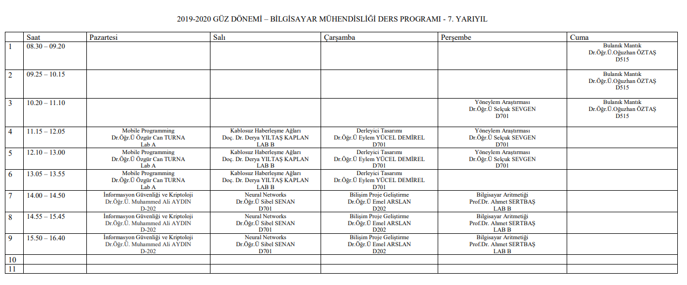

# 📅 Ders Programları

## 1.Sınıf Ders Programı

## 2.Sınıf Ders Programı

## 3.Sınıf Ders Programı

## 4.Sınıf Ders Programı

- İnformasyon Güvenliği ve Kriptoloji dersi **A Blok 721'de saat 14:00**'da yapılacaktır.
- Bilişim Proje Geliştirme dersi **9:30**'ta **D701**'de başlamaktadır.

> Aksiten duyurulmuştur (08.10.2019)

