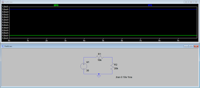
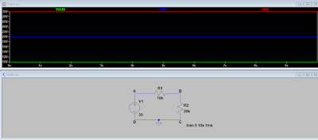
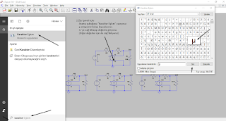

# 👩‍🔬 Lab Notları \| DvS

## 👩‍🔬 Lab Bilgileri

Lab dersinde **LTspice** uygulaması kullanılmaktadır.

- Resmi sitesi için [buraya][LTspice Website] bakabilir
- [Windows][LTspice Windows] ve [MAC][LTspice MAC] için linklerden indirme yapabilirsin.

### 👩‍🔬 Lab-1 Notları

#### Yapılacaklar

- R1, R2 üzerinden geçen akım
- A, B, C noktaları arasındaki gerilim
- tran analiz ve dc anazliz şeklinde hesaplanacak.

#### Teslim Şekli

İlk kağıtta (kapak sayfasında), **"Uygulama 1"** şeklinde bir yazı bulunması şartıyla üstteki her işlemin **ekran görüntüsü word sayfasına kaydedilecek** ve çıktısı **şeffaf dosya içerisinde** hocaya teslim edilecek.

#### DC Analizi

`Simulate -> Edit Simulation CMD -> Dc Swift` açılarak alttaki resimdeki değerler girilmeli ve devranın herhangi bir kenarındaki boş yere eklenmeli (devre üstüne değil)

R1 R2 akım değerleri:

A, B, C arasındaki gerilim:

#### Transient Analiz

`Simulate -> Edit Simulation CMD -> Transient` açılarak alttaki resimdeki değerler girilmeli ve devranın herhangi bir kenarındaki boş yere eklenmeli (devre üstüne değil)

R1 R2 akım değerleri:

A, B, C arasındaki gerilim:

### 👩‍🔬 Lab-2 Notları

>⚠ Aşağıdaki resimler labda yapılanlarla alakalıdır, ödevin kendisi değildir.

Adım adım devreninin çizilimi için aşağıdaki resimleri takip edebilirsin (💡 soldan sağa doğru ilerler):

[LTspice Website]: http://www.linear.com/designtools/software/
[LTspice Windows]: http://ltspice.linear-tech.com/software/LTspiceXVII.exe
[LTspice MAC]: http://ltspice.linear-tech.com/LTspiceIV.dmg
